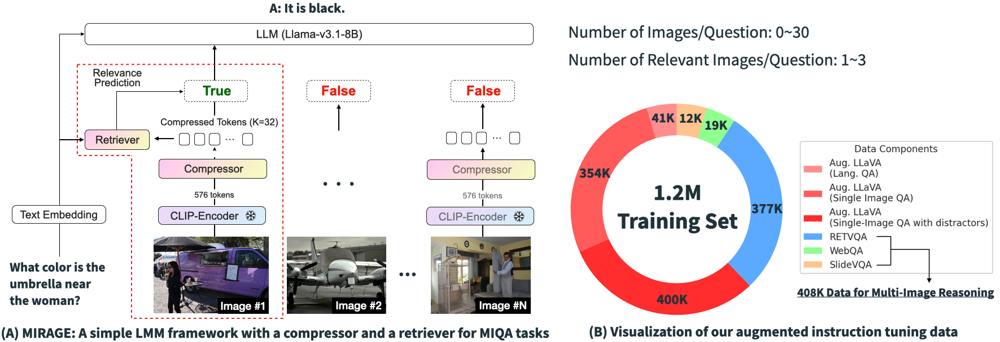
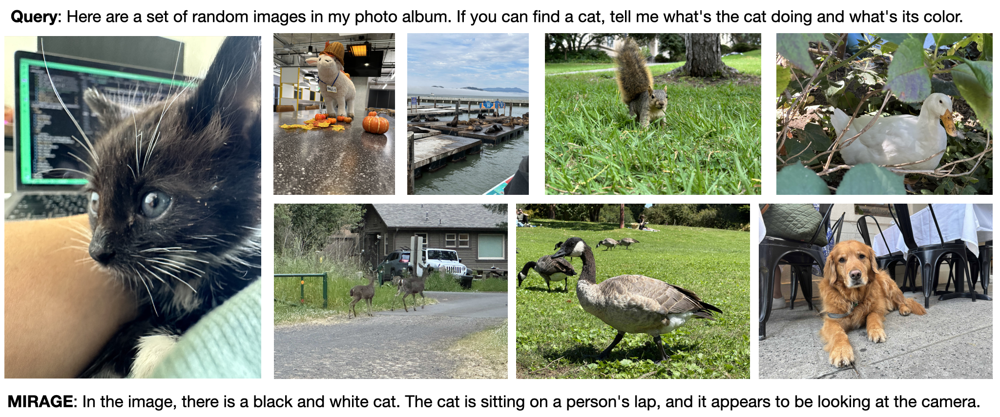
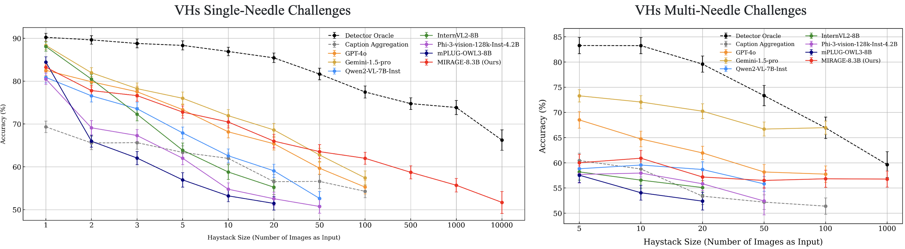

# MIRAGE: Multi-Image Retrieval Augmented GEneralization

[](https://lbesson.mit-license.org/)  [](https://arxiv.org/abs/2407.13766) 

***International Conference on Learning Representations (ICLR) 2025***

Welcome to the official repository for our paper: [Visual Haystacks: A Vision-Centric Needle-In-A-Haystack Benchmark](https://arxiv.org/abs/2407.13766). Explore our project page [here](https://visual-haystacks.github.io/) and the benchmark toolkits [here](https://github.com/visual-haystacks/vhs_benchmark)!

**Authors**: [Tsung-Han Wu](https://tsunghan-wu.github.io/), [Giscard Biamby](https://scholar.google.com/citations?user=s0Fof5IAAAAJ&hl=en), [Jerome Quenum](https://people.eecs.berkeley.edu/~jquenum/), [Ritwik Gupta](https://ritwikgupta.me/), [Joseph E. Gonzalez](https://people.eecs.berkeley.edu/~jegonzal/), [Trevor Darrell](https://people.eecs.berkeley.edu/~trevor/), [David M. Chan](https://dchan.cc/) at UC Berkeley. 

**Visual Haystacks (VHs) Benchmark Dataset**: [🤗 tsunghanwu/visual_haystacks](https://huggingface.co/datasets/tsunghanwu/visual_haystacks), [🐙 Github Repo](https://github.com/visual-haystacks/vhs_benchmark)

**Model Checkpoint**: [🤗tsunghanwu/mirage-llama3.1-8.3B](https://huggingface.co/tsunghanwu/mirage-llama3.1-8.3B)

## :rocket: Introduction

This paper addresses the challenge of answering questions across tens of thousands of images. Through extensive [experiments](https://github.com/visual-haystacks/vhs_benchmark) through our Visual Haystacks (VHs) benchmark, we demonstrated that existing Large Multimodal Models (LMMs) struggle with inputs exceeding 100 images due to API limitations, context overflow, or hardware constraints on 4 A100 GPUs. These models often face issues such as visual distractions, cross-image reasoning difficulties, and positional biases. To overcome these challenges, we developed MIRAGE (8.3B), a pioneering, open-source visual-RAG baseline model based on LMMs capable of handling tens of thousands of images. In brief, MIRAGE integrates a compressor module that reduces image tokens by 18x, a dynamic query-aware retriever to filter irrelevant images, and a custom-trained LMM that can do multi-image reasoning. MIRAGE sets a new standard in open-source performance on the Visual Haystacks (VHs) benchmark and delivers solid results on both single- and multi-image question answering tasks.



## :wrench: Installation Guide

1. Clone this repository and navigate to mirage folder
```bash
git clone https://github.com/visual-haystacks/mirage.git
cd mirage
```

2. Install Package
```Shell
conda create -n mirage python=3.10 -y
conda activate mirage
pip install --upgrade pip  # enable PEP 660 support
pip install -e .
```

3. Install additional packages for training cases
```
pip install -e ".[train]"
pip install flash-attn --no-build-isolation --no-cache-dir
```

## :gear: Quick Start / Demo
- Model Checkpoint: [🤗tsunghanwu/mirage-llama3.1-8.3B](https://huggingface.co/tsunghanwu/mirage-llama3.1-8.3B)
- Demo code (single test case): `CUDA_VISIBLE_DEVICES=X python3 demo.py --model-path [huggingface model id or local path] --image-folder [local image folder] --prompt [prompt path]`
- Here’s a sample output from MIRAGE using some photos I took on my iPhone. (Feel free to give it a star if you think my cat is adorable! 😺✨)


<h2>📈 Evaluation</h2>

<h3>1. Data Preparation</h3>
<ul>
    <li>For Visual Haystacks (VHs), download the data from <a href="https://huggingface.co/datasets/tsunghanwu/visual_haystacks">🤗 tsunghanwu/visual_haystacks</a> and place it in <code>playground/data/eval/visual_haystacks</code>.</li>
    <li>For single-image QA, download all data according to <a href="https://github.com/haotian-liu/LLaVA/blob/main/docs/Evaluation.md">LLaVA's instructions</a>.</li>
    <li>For multi-image QA, download <a href="https://drive.google.com/file/d/1_YHHNGJqprT30XPUyVW9F8oGOxuavVwN/view?usp=sharing">RETVQA's test set</a> and place it in <code>playground/data/eval/retvqa</code>. For evaluation, refer to <a href="https://github.com/Abhiram4572/mi_bart">RETVQA's GitHub Repo</a>.</li>
</ul>
<p>In summary, the data structure of <code>playground/data/eval</code> should look like this:</p>
<details>
    <summary>Show Data Structure</summary>
    <pre>
playground/data/eval/
├── gqa
│   ├── answers
│   ├── data                   # directory
│   ├── llava_gqa_testdev_balanced.jsonl
├── mmbench
│   ├── answers
│   ├── answers_upload
│   └── mmbench_dev_20230712.tsv
├── mmbench_cn
│   ├── answers
│   ├── answers_upload
│   └── mmbench_dev_cn_20231003.tsv
├── mm-vet
│   ├── answers
│   ├── images                  # directory
│   ├── llava-mm-vet.jsonl
│   └── results
├── pope
│   ├── answers
│   ├── coco                    # directory (point to COCO2014)
│   └── llava_pope_test.jsonl
├── retvqa
│   ├── answers
│   ├── vg                     # directory (point to Visual Genome directory)
│   └── retvqa_test_mirage.json
├── textvqa
│   ├── answers
│   ├── llava_textvqa_val_v051_ocr.jsonl
│   ├── TextVQA_0.5.1_val.json
│   └── train_images           # directory (download from their website)
├── visual_haystacks
│   ├── coco             # directory (point to COCO2017)
│   └── VHs_qa           # directory (download from VHs' huggingface)
├── vizwiz
│   ├── answers
│   ├── answers_upload
│   ├── llava_test.jsonl
│   └── test                   # directory (download from their website)
└── vqav2
    ├── answers
    ├── answers_upload
    ├── llava_vqav2_mscoco_test2015.jsonl
    ├── llava_vqav2_mscoco_test-dev2015.jsonl
    └── test2015               # directory (download from their website)
    </pre>
</details>

<h3>2. Run Scripts</h3>
<pre><code># Visual Haystacks
CUDA_VISIBLE_DEVICES=0 bash scripts/eval/{vhs_single,vhs_multi}.sh
# VQAv2, GQA, RetVQA
CUDA_VISIBLE_DEVICES=0,1,2,3,4,5,6,7 bash scripts/eval/{vqav2,gqa,retvqa}.sh
# Vizwiz, TextVQA, POPE, MMBench, MMBench-CN, MM-Vet
CUDA_VISIBLE_DEVICES=0 bash scripts/eval/{vizwiz,textvqa,pope,mmbench,mmbench_cn,mmvet}.sh
</code></pre>

<h3>3. Results</h3>
<p></p>
<table>
    <thead>
        <tr>
            <th>Checkpoint</th>
            <th>VQAv2</th>
            <th>GQA</th>
            <th>VizWiz</th>
            <th>TextVQA</th>
            <th>POPE</th>
            <th>MM-Bench</th>
            <th>MM-Bench-CN</th>
            <th>MM-Vet</th>
        </tr>
    </thead>
    <tbody>
        <tr>
            <td><a href="https://huggingface.co/tsunghanwu/mirage-llama3.1-8.3B">🤗 tsunghanwu/mirage-llama3.1-8.3B</a></td>
            <td>76.56</td>
            <td>59.13</td>
            <td>40.52</td>
            <td>56.24</td>
            <td>85.40</td>
            <td>69.24</td>
            <td>66.92</td>
            <td>33.4</td>
        </tr>
    </tbody>
</table>


## :fire: Training

### 1. Data Preparation
  - Please download the dataset from [🤗 tsunghanwu/MIRAGE-training-set](https://huggingface.co/datasets/tsunghanwu/MIRAGE-training-set).
  - For stage-1 pre-training (training Q-Former and MLP projector), download datasets such as CC-12M, LAION-400M, and COCO.
  - For stages 2 and 3 pre-training, which involve training Q-Former/MLP projector with high-quality captions and training the downstream retriever module with augmented LLaVA data, download SAM, VG, COCO, TextVQA, OCR_VQA, and GQA to `playground/data`.
  - For instruction tuning, download SAM, VG, COCO, TextVQA, OCR_VQA, GQA, slidevqa, and webqa to `playground/data`.

Below is the expected data structure for `playground/data/eval`:

<details>
    <summary>Show Data Structure</summary>
    <pre>
playground/data/
├── coco
│   ├── annotations
│   ├── test2017
│   ├── train2017
│   └── val2017
├── gqa
│   └── images
├── ocr_vqa
│   └── images
├── sam
│   └── images 
├── share_textvqa
│   └── images
├── slidevqa
│   └── images (download from https://drive.google.com/file/d/11bsX48cPpzCfPBnYJgSesvT7rWc84LpH/view)
├── textvqa
│   └── train_images
├── vg
│   ├── VG_100K
│   └── VG_100K_2
└── webqa
    └── webqa_images (download from https://drive.google.com/drive/folders/1ApfD-RzvJ79b-sLeBx1OaiPNUYauZdAZ and convert them to .jpg format)
    </pre>
</details>

### 2. Pretraining/Finetuning

Run the following script with minor modifications as needed. Note: During the finetuning, we found that freezing the downstream retriever but only updating Q-Former/LLM leads to better performance on LLama-3.1-8b, whereas unfreezing the retriever yields better results on vicuna-v1.5-7b.

```bash
# Stage 1-3 Pretraining
bash scripts/pretrain_stage{1,2,3}.sh
# Instruction Finetuning
bash scripts/finetune_qformer_lora.sh
```

### 3. Weight Merging

Please merge LoRA weights back to the original checkpoint using the following code:

```bash
python scripts/merge_lora_weights.py \
    --model-path checkpoints/mirage_qformer_ft \
    --model-base meta-llama/Meta-Llama-3.1-8B-Instruct \
    --save-model-path your_output_path
```

## :pray: Acknowledgements

We are grateful for the foundational code provided by [LLaVA](https://github.com/haotian-liu/LLaVA) and [LLaVA-More](https://github.com/aimagelab/LLaVA-MORE). Utilizing their resources implies agreement with their respective licenses. Our project benefits greatly from these contributions, and we acknowledge their significant impact on our work. 

## :dart: Citation

If you use our work or our implementation in this repo or find them helpful, please consider giving a citation.
```
@article{wu2024visual,
  title={Visual Haystacks: A Vision-Centric Needle-In-A-Haystack Benchmark},
  author={Wu, Tsung-Han and Biamby, Giscard and and Quenum, Jerome and Gupta, Ritwik and Gonzalez, Joseph E and Darrell, Trevor and Chan, David M},
  journal={International Conference on Learning Representations},
  year={2025},
  url={https://arxiv.org/abs/2407.13766}
}
```
